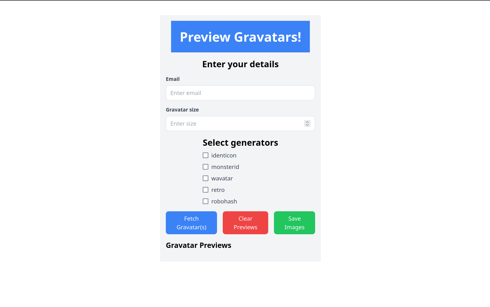
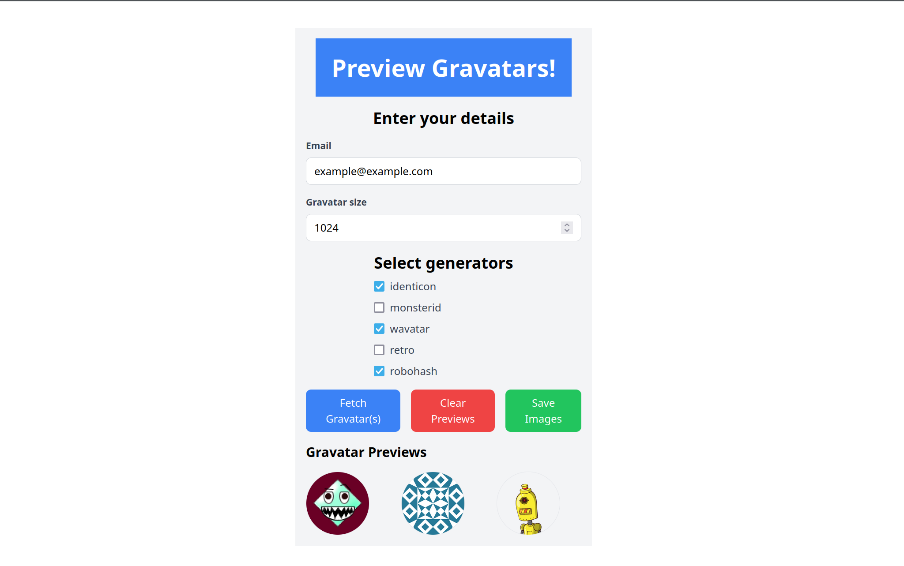

# Gravatar fetching

Learning [React](https://react.dev/) and [Docker](https://gravatar.com/) by way of [Gravatar](https://gravatar.com/).

Useful guides:
- [Gravatar API](https://docs.gravatar.com/getting-started/)
- [Docker by EPCC](https://epcced.github.io/2024-11-11_containers_epcc/)

App preview:

Based on [repo](https://github.com/aliakatas/mypygravatar).
