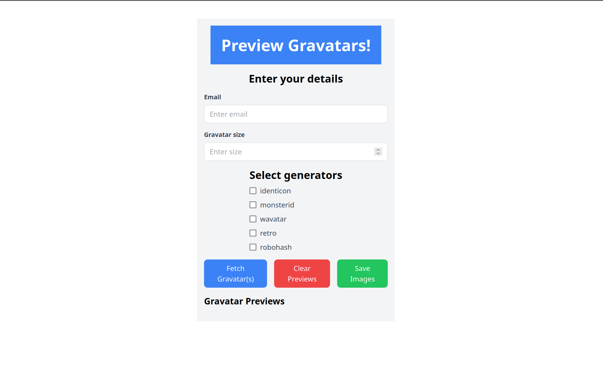
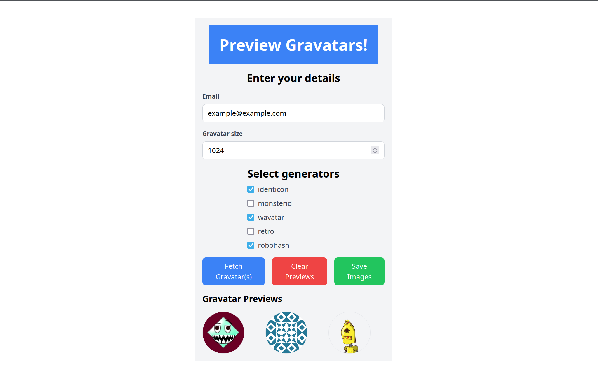

# Gravatar fetching

Learning [React](https://react.dev/) and [Docker](https://gravatar.com/) by way of [Gravatar](https://gravatar.com/).

Useful guides:
- [Gravatar API](https://docs.gravatar.com/getting-started/)
- [Docker by EPCC](https://epcced.github.io/2024-11-11_containers_epcc/)

App preview:




Based on [repo](https://github.com/aliakatas/mypygravatar).

## Build
If you want to update or generate `package.json` and `package-lock.json` without installing `npm` on your **host machine**, you can do it entirely inside a **Docker container**. Here's how:

---

### 🐳 Option 1: Use a Temporary Node Container to Generate the Files

Assuming your React source code is in a directory (e.g., `my-react-app/`), you can run:

```bash
docker run --rm -v "$PWD/my-react-app:/app" -w /app node:18-alpine sh -c "
  [ -f package.json ] || npm init -y && \
  npm install react react-dom && \
  npm install --save-dev vite
"
```

This:

* Mounts your project into the container
* Initializes `package.json` if not already present
* Installs `react`, `react-dom`, and `vite`
* Generates `package-lock.json`

✅ This way, your host stays clean — no `npm` needed.

---

### 🐳 Option 2: Use a Custom Dockerfile Just for Dependency Management

You can also use a temporary container setup like this:

**Dockerfile.setup**

```Dockerfile
FROM node:18-alpine
WORKDIR /app
COPY . .
RUN [ ! -f package.json ] && npm init -y || true
RUN npm install react react-dom && npm install --save-dev vite
```

Then run:

```bash
docker build -f Dockerfile.setup -t react-setup .
docker create --name temp-container react-setup
docker cp temp-container:/app/package.json ./my-react-app/
docker cp temp-container:/app/package-lock.json ./my-react-app/
docker rm temp-container
```

This gives you the updated `package.json` and `package-lock.json` without installing anything locally.

---

Or with `podman`:
```bash
podman build --no-cache -f Dockerfile.setup -t react-setup .
podman create --name temp-container react-setup
podman cp temp-container:/fetch-gravatars/package.json ./fetch-gravatars/
podman cp temp-container:/fetch-gravatars/package-lock.json ./fetch-gravatars/
podman rm temp-container
```

